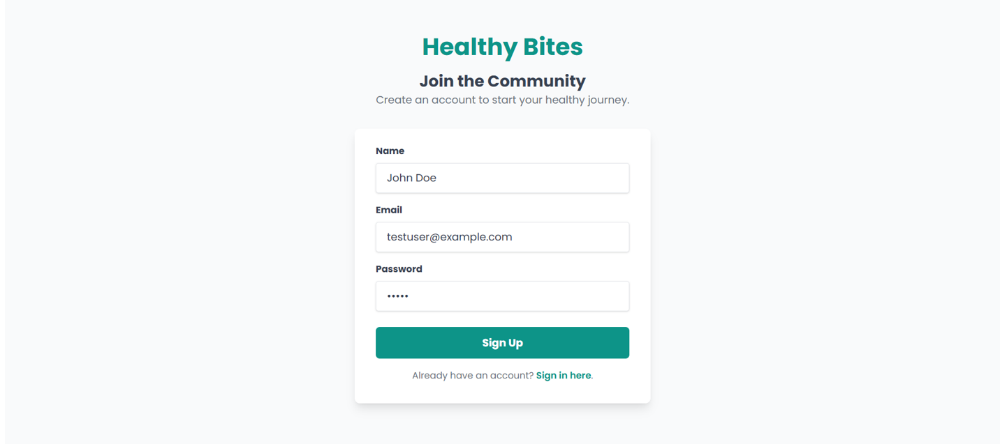
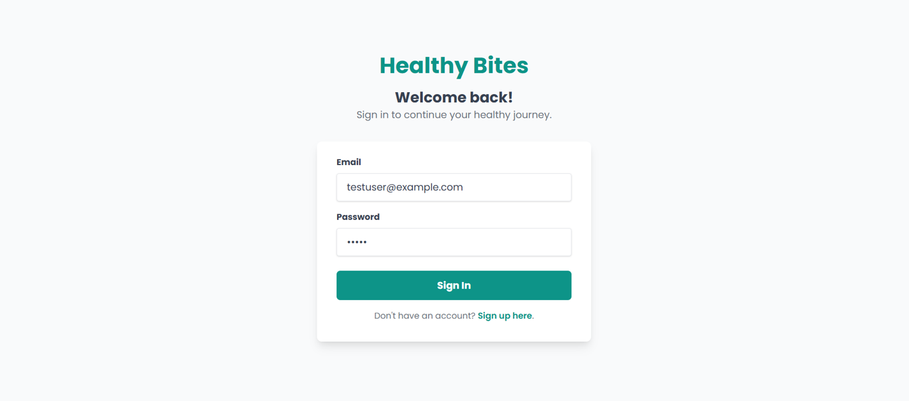
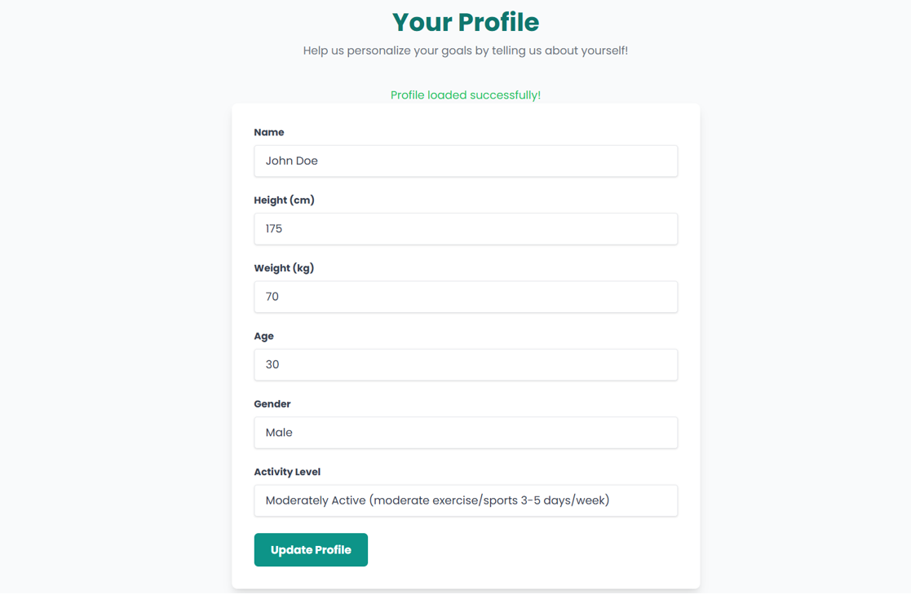
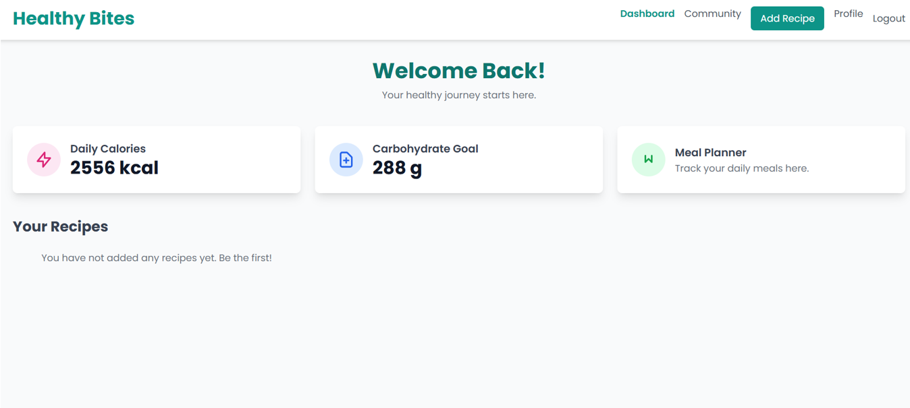
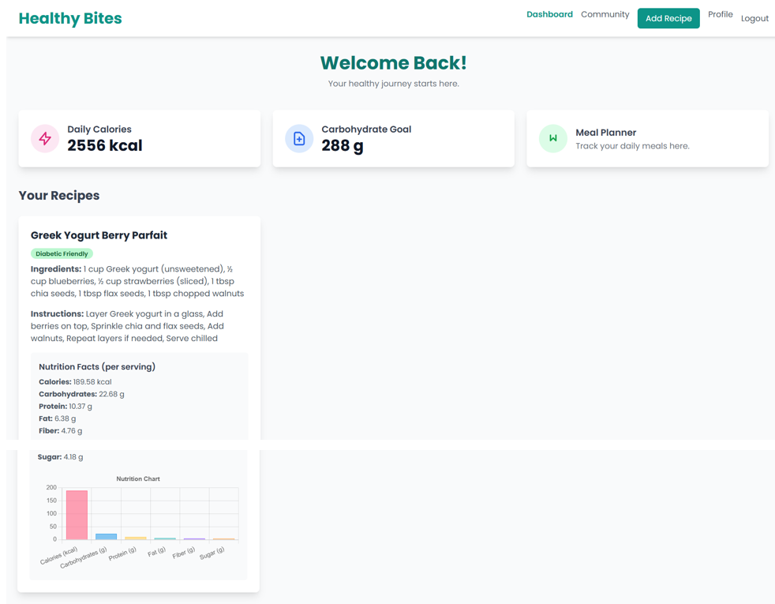
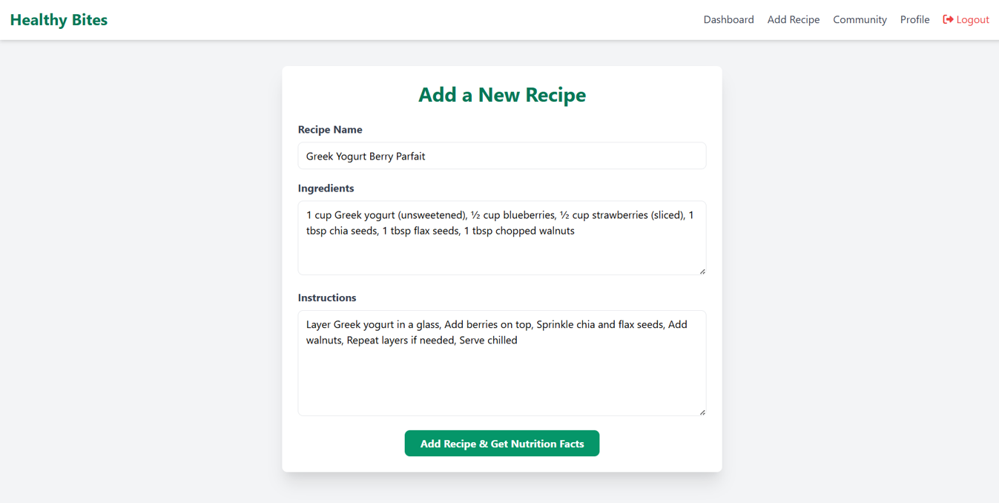
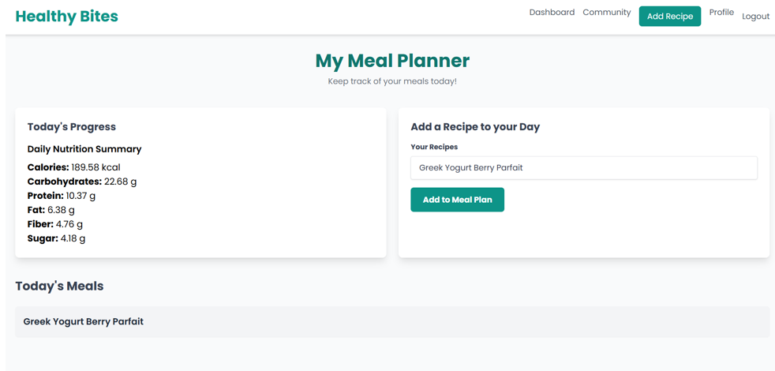
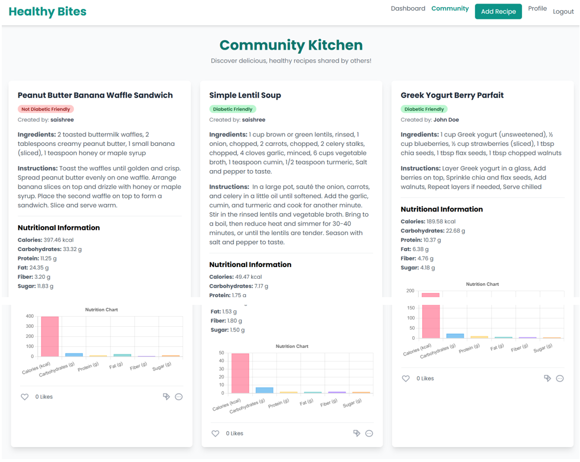

# 🍽️ Healthy Bites – AI-Powered Diabetic-Friendly Recipe Platform

## 📌 Overview

Healthy Bites is a full-stack web application that helps users create, analyze, and share healthy recipes with a focus on diabetic-friendly nutrition. The system uses a Machine Learning microservice to automatically predict nutritional values and classify recipes as diabetic-safe.

---

## 🚀 Key Features

* 🔐 User Authentication (Sign Up & Login)
* 👤 Profile Management (health details & personalization)
* 🏠 Dashboard with calorie & nutrition goals
* ➕ Add recipes with minimal input
* 🤖 ML-based nutrition prediction
* 📊 Nutrition analysis & visualization
* 📅 Meal planning system
* 🌍 Community recipe sharing

---

## 🛠️ Tech Stack

**Frontend**

* HTML
* Tailwind CSS
* JavaScript

**Backend**

* Node.js
* Express.js

**Machine Learning**

* Python
* Flask
* Scikit-learn

**Database**

* MongoDB

---

## 🧠 How It Works

1. User adds recipe details
2. Backend sends ingredients to ML service
3. ML model predicts nutrition values
4. Data stored in MongoDB
5. Results displayed on dashboard

---

## 📂 Project Structure

```id="t2y9nf"
healthy-bites/
│── frontend/
│── backend/
│── ml-service/
│── assets/
│── README.md
```

---

## 📸 Screenshots

### 🔐 Authentication




---

### 👤 User Profile



---

### 🏠 Dashboard




---

### ➕ Add Recipe



---

### 📅 Meal Planner



---

### 🌍 Community



---

## ⚙️ Setup Instructions

### 1️⃣ Clone Repository

```id="r7j3nc"
git clone https://github.com/Saishree-B/healthy-bites.git
cd healthy-bites
```

---

### 2️⃣ Backend Setup

```id="rmnv40"
cd backend
npm install
npm start
```

---

### 3️⃣ ML Service Setup

```id="c69kmi"
cd ml-service
pip install -r requirements.txt
python app.py
```

---

### 4️⃣ Frontend

Open `frontend/index.html` in browser

---

## 📊 Dataset

* USDA FoodData Central (U.S. Department of Agriculture)

---

## ⚠️ Notes

* Large datasets and ML models are excluded due to GitHub size limits
* Models can be regenerated using training scripts

---

## 🎯 Future Improvements

* Personalized diet recommendations
* Mobile responsiveness
* Cloud deployment
* Advanced analytics dashboard

---

## 👩‍💻 Author

**Sai Shree B**
GitHub: https://github.com/Saishree-B

---

## ⭐ Acknowledgements

* USDA FoodData Central dataset
* Open-source libraries

---

## 💡 Motivation

This project combines Machine Learning and Full-Stack Development to provide meaningful health insights and improve dietary decision-making.

---
